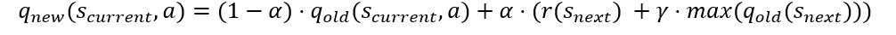

## RL workshop tasks
### Materials
- [Deeplizard’s playlist for reinforcement learning](https://www.youtube.com/playlist?list=PLZbbT5o_s2xoWNVdDudn51XM8lOuZ_Njv) 
- [Thomas Simonini Q-Learning course](https://thomassimonini.medium.com/q-learning-lets-create-an-autonomous-taxi-part-1-2-3e8f5e764358)

### Tasks
[Open AI Gym](https://gym.openai.com/)
1.	Default (4x4) frozen lake
2.	Slippery frozen lake 
3.	Cart pole
### Bonus tasks
4.	Taxi
5.	Random frozen lake
6.	tic tac toe (make your own gym environment!)

### Open Ai Gym Wiki (solve criteria)
e.g. https://github.com/openai/gym/wiki/MountainCar-v0#solved-requirements

- https://github.com/openai/gym/wiki/FrozenLake-v0
- https://github.com/openai/gym/wiki/MountainCar-v0#solved-requirements